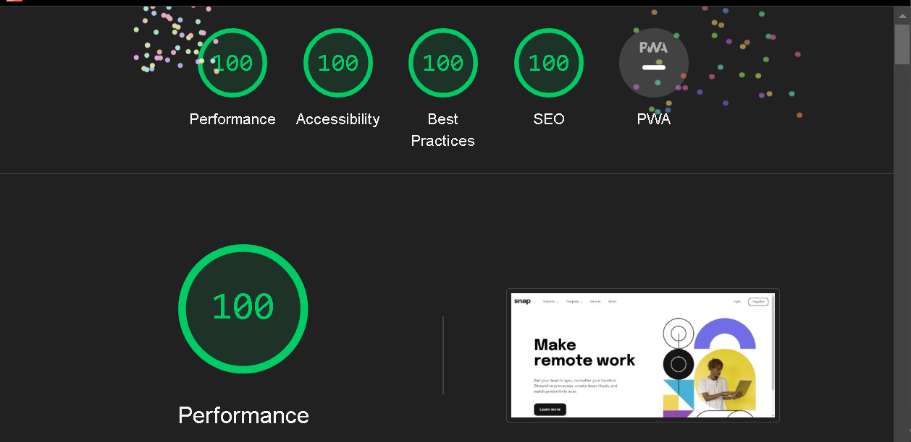

# Frontend Mentor - Intro section with dropdown navigation solution

This is a solution to the [Intro section with dropdown navigation challenge on Frontend Mentor](https://www.frontendmentor.io/challenges/intro-section-with-dropdown-navigation-ryaPetHE5). Frontend Mentor challenges help you improve your coding skills by building realistic projects.

## Table of contents

- [Overview](#overview)
  - [The challenge](#the-challenge)
  - [Screenshot](#screenshot)
  - [Links](#links)
- [My process](#my-process)
  - [Built with](#built-with)
- [Author](#author)
- [Acknowledgments](#acknowledgments)

## Overview

### The challenge

Users should be able to:

- View the relevant dropdown menus on desktop and mobile when interacting with the navigation links
- View the optimal layout for the content depending on their device's screen size
- See hover states for all interactive elements on the page

### Screenshot




### Links

- Solution URL: [Add solution URL here](https://your-solution-url.com)
- Live Site URL: [click here](https://jithin-bp-intro-section-with-dropdown.netlify.app/)

## My process

### Built with

- Semantic HTML5 markup
- CSS custom properties
- Flexbox
- Mobile-first workflow
- [React](https://reactjs.org/) - JS library
- [tailwind](https://tailwindcss.com/) - For styles

## Author

- [Jithin B P]()
- Frontend Mentor - [@Jithin-b-p](https://www.frontendmentor.io/profile/Jithin-b-p)
- twitter - [@b_p_jithin](https://twitter.com/b_p_jithin)

## Acknowledgments

- Install dependencies:

```bash
npm install
```

- run in development mode:

```bash
npm run dev
```

Open http://localhost:5173 to view it in your browser.
